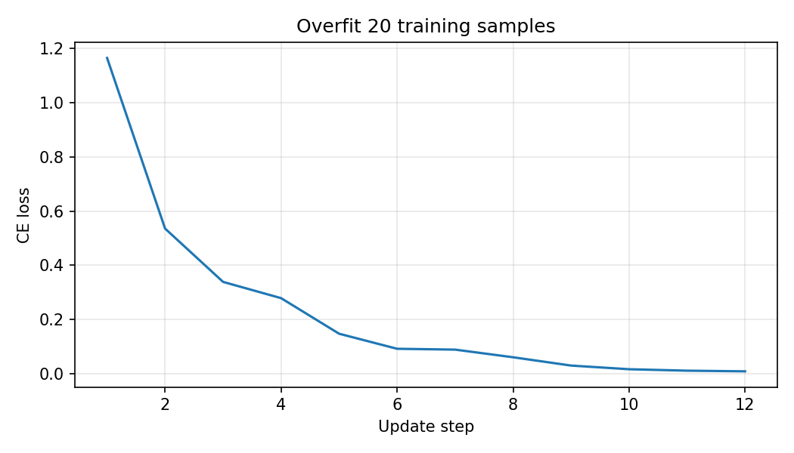
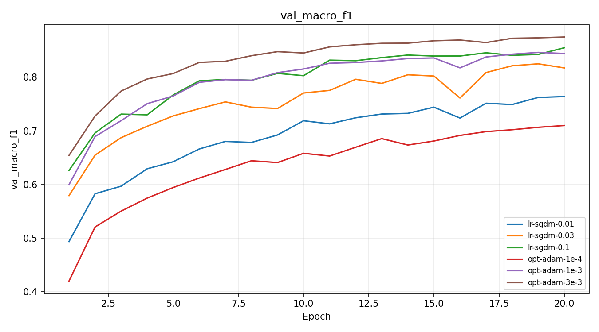
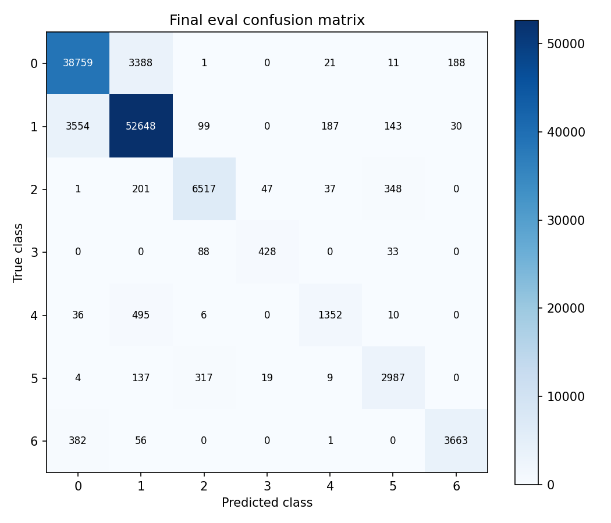

# Báo cáo Lab Day 1 — MSSV 2A202602941

## 1. Thiết lập

Thí nghiệm chạy trên Google Colab, GPU Tesla T4, PyTorch 2.11.0+cu130 (output `code/lab.ipynb`). Forest CoverType có 54 đặc trưng, 7 lớp, nhãn 0–6. Theo metadata cố định, train có 464.809 mẫu và eval có 116.203 mẫu. Tách validation phân tầng 20%, seed 42: còn 371.847 mẫu huấn luyện và 92.962 mẫu validation. Chỉ dùng thống kê phần huấn luyện để chuẩn hoá 10 cột liên tục; giữ nguyên 44 cột one-hot. Accuracy của dự đoán lớp đa số trên validation là 0,487597 (`init-zeros`).

Baseline `base-s1`: M-base 54→256→128→7, ReLU, 47.879 tham số, logits chưa softmax; CE, SGD momentum 0,9, lr 0,1, batch 512, 20 epoch, He, FP32, không dropout, clipping hay weight decay. Lr baseline được chọn trong ba giá trị 0,01/0,03/0,1 bằng validation. Mọi run dùng cùng split và 20 epoch. Train loss được đo ở eval mode trên tập con cố định 50.000 mẫu, không phải toàn bộ train.

Với mỗi run, checkpoint lấy tại epoch có **validation loss thấp nhất**. Sau đó so sánh macro-F1 validation của các checkpoint để chọn cấu hình. Vì vậy, `val_macro_f1` trong bảng không nhất thiết là macro-F1 lớn nhất trong toàn bộ lịch sử. Tất cả số liệu thí nghiệm dưới đây truy về dòng `exp_id` trong `experiments.xlsx` và `results/<exp_id>.json`.

## 2. Kiểm tra ban đầu và độ nhiễu

Kiểm tra ở seed 1 cho logits (8,7), đúng 47.879 tham số. Loss bước 0 của `base-s1` là 2,269062, cao hơn ln(7)=1,945910 khoảng 0,323152. He tạo logits không đồng đều nên đây chưa phải bằng chứng lỗi. Cả sáu tensor tham số đều có gradient khác 0, norm từ 0,393155 đến 2,776932. Mô hình riêng học thuộc 20 mẫu sau 12 bước: loss 0,008225, accuracy 1,0 (`health_checks_summary.json`, output Part 1). Các kiểm tra này hỗ trợ tính đúng của forward, backward và cập nhật tham số.

| Baseline | Val accuracy | Val macro-F1 | Epoch checkpoint |
|---|---:|---:|---:|
| `base-s1` | 0,906069 | 0,854950 | 20 |
| `base-s2` | 0,908414 | 0,855442 | 19 |
| `base-s3` | 0,908048 | 0,858258 | 19 |
| Trung bình ± độ lệch chuẩn mẫu | 0,907511 ± 0,001262 | 0,856217 ± 0,001785 | — |

Ngưỡng tham khảo 2σ macro-F1 là **0,003570**. Baseline seed 1 có train/val loss giảm từ 0,458290/0,465218 xuống 0,208438/0,234496, dù có dao động giữa các epoch. Accuracy vượt rõ mốc đa số. Chỉ ba seed nên 2σ là ước lượng thô, không phải kiểm định ý nghĩa thống kê. Các kỹ thuật còn lại chủ yếu chỉ chạy seed 1. Chênh lệch trong phần diễn giải so với `base-s1`; cột công thức `delta_val_f1_vs_base` của Excel dùng trung bình ba seed, còn `notes` ghi chênh lệch so với seed 1.

## 3. Kết quả theo chủ đề

### 3.1 Hàm mất mát

Dự đoán đã ghi trước run: MSE trên logits có thể hội tụ khác CE, cần so bằng metric. `loss-mse` đạt macro-F1 0,726127, giảm 0,128822 so với `base-s1`, lớn hơn 2σ. MSE ở đây hồi quy logits về one-hot, trung bình trên 7 lớp, **không phải MSE trên xác suất softmax**. CE trực tiếp tối ưu phân phối lớp; MSE ràng buộc giá trị tuyệt đối của logits và có thang gradient khác. Giữ cùng lr có thể chưa tối ưu cho MSE, nên kết luận chỉ áp dụng cho thiết lập đã thử. Không so trực tiếp loss 0,029426 của MSE với loss CE. [Biểu đồ loss](figures/compare_loss.png).

### 3.2 Bộ tối ưu hoá và learning rate

Dự đoán: lr thấp học chậm; Adam ở lr lớn hơn có thể tiến bộ nhanh hoặc dao động. Mỗi optimizer được thử ba lr.

| `exp_id` | Optimizer | lr | Val macro-F1 | Epoch checkpoint |
|---|---|---:|---:|---:|
| `lr-sgdm-0.01` | SGD momentum | 0,01 | 0,763963 | 20 |
| `lr-sgdm-0.03` | SGD momentum | 0,03 | 0,821299 | 18 |
| `lr-sgdm-0.1` | SGD momentum | 0,1 | 0,854950 | 20 |
| `opt-adam-1e-4` | Adam | 0,0001 | 0,709941 | 20 |
| `opt-adam-1e-3` | Adam | 0,001 | 0,846267 | 19 |
| `opt-adam-3e-3` | Adam | 0,003 | **0,872611** | 18 |

Ở lr tốt nhất trong lưới đã thử, Adam hơn SGD momentum 0,017661, vượt 2σ baseline. Tuy nhiên Adam lr 0,001 lại thấp hơn baseline 0,008683: kết luận về optimizer phụ thuộc cách chỉnh lr. Adam điều chỉnh bước theo moment gradient; số liệu phù hợp với lợi ích của bước thích nghi ở lr 0,003, nhưng chưa chứng minh Adam luôn tốt hơn. `lr-sgdm-0.1` và `base-s1` có cùng cấu hình/seed và kết quả giống nhau; không xem chúng là hai seed độc lập.

### 3.3 Batch và độ rộng

Dự đoán: batch lớn giảm số cập nhật; mạng rộng có thể giảm thiếu khớp. `batch-2048` đạt 0,805526, giảm 0,049424; thời gian/epoch 0,319805 s so với 1,229027 s baseline. Chỉ có 182 bước/epoch thay vì 727, nên cùng 20 epoch không đồng nghĩa cùng ngân sách cập nhật. `wide` (54→512→256→7, 161.287 tham số) đạt 0,860831, tăng 0,005881, vượt 2σ nhưng cần thêm seed để xác nhận. Accuracy `wide` là 0,917160, cao hơn Adam được chọn, song macro-F1 thấp hơn; điều này cho thấy cần dùng metric chính khi dữ liệu mất cân bằng. [Biểu đồ hyper-parameter](figures/compare_hparam.png).

### 3.4 Dropout

Dự đoán: dropout có thể giảm quá khớp nhưng làm baseline chưa học đủ tiến chậm hơn. `drop-0.3` đạt 0,788093, giảm 0,066856, vượt 2σ. Khoảng cách loss cuối val–train giảm từ 0,026058 (`base-s1`) xuống 0,009960, nhưng cả train loss (0,308178) và val loss (0,318138) đều cao hơn baseline. Khoảng cách nhỏ hơn không đồng nghĩa tổng quát hoá tốt hơn. Với ngân sách 20 epoch, dropout 0,3 phù hợp với hiện tượng thiếu khớp hơn; nên thử mức nhỏ hơn hoặc chỉ dùng khi validation xấu đi trong lúc train tiếp tục cải thiện. [Biểu đồ dropout](figures/compare_dropout.png).

### 3.5 Gradient clipping

Ngưỡng c=0,282902 lấy từ norm baseline. Dự đoán: clipping dưới norm thường gặp sẽ tác động rõ; ở lr cao có thể hạn chế bất ổn. `clip-normal` clip 99,725–100% batch mỗi epoch, đạt 0,827285, giảm 0,027664 so với baseline. Norm trước clip trung bình 0,597763–1,021225 cho thấy ngưỡng quá chặt với lr 0,1.

Ở cùng lr 1,0, `highlr-no-clip` đạt 0,777400 và `highlr-clip` đạt 0,813176: tăng 0,035776, vượt 2σ tham khảo. Norm cực đại ghi nhận giảm từ 9,701720 xuống 2,843747; tỷ lệ clip của run lr cao là 9,354–59,835%. Cả hai đều hoàn thành, không diverged, nên clipping cải thiện run lr cao chứ không phải cứu một run đã phân kỳ. Kết quả vẫn thấp hơn baseline lr 0,1. Clipping giới hạn gradient lớn, không thay thế lựa chọn lr phù hợp. [Biểu đồ clipping](figures/compare_clipping.png).

### 3.6 Mixed precision

Dự đoán: FP16 có thể giảm bộ nhớ nhưng MLP nhỏ chưa chắc nhanh; BF16 có dải số mũ rộng hơn.

| `exp_id` | Precision | Val macro-F1 | Giây/epoch | Peak allocated MB |
|---|---|---:|---:|---:|
| `base-s1` | FP32 | 0,854950 | 1,229027 | 172,000977 |
| `amp-fp16` | FP16 | 0,845730 | 1,686502 | 172,001953 |
| `amp-bf16` | BF16 | 0,836626 | 1,472085 | 172,000977 |

Cả hai AMP đều chậm hơn và giảm macro-F1 vượt 2σ. FP16 bỏ qua 3 bước cập nhật; BF16 không bỏ bước. Bộ nhớ gần như không đổi. Mạng nhỏ, dữ liệu tensor FP32 vẫn ở GPU và chi phí autocast/scaler là các giải thích hợp lý, chưa được tách riêng bằng profiling. Đây là kết quả thực đo trên T4 và pipeline này, không suy rộng sang GPU hoặc mạng khác. [Biểu đồ AMP](figures/compare_amp.png).

### 3.7 Khởi tạo

Dự đoán: Xavier giảm phương sai kích hoạt; zeros không học được đặc trưng hữu ích. Độ lệch chuẩn sau ba Linear: He 0,709929/0,697585/0,618318; `init-xavier` 0,274872/0,218081/0,191994; `init-zeros` đều bằng 0. Loss bước 0 lần lượt 2,269062, 2,022176, 1,945910. Xavier đạt macro-F1 0,858928, hơn seed 1 khoảng 0,003979, chỉ nhỉnh hơn 2σ: chưa đủ mạnh để khẳng định ưu thế ổn định.

Zeros đạt accuracy 0,487597, macro-F1 0,093650 dù loss giảm về khoảng 1,205219. Với trọng số 0 và ReLU, các lớp ẩn không có tín hiệu hữu ích; bias đầu ra có thể học tần suất lớp nhưng không học quan hệ đầu vào. Loss gần ln(7) lúc đầu vì thế không đảm bảo mạng đúng. He dùng phương sai phù hợp ReLU, còn Xavier cân bằng fan-in/fan-out; ở mạng này cả hai khởi tạo ngẫu nhiên đều học được. [Biểu đồ khởi tạo](figures/compare_init.png).

## 4. Đánh giá cuối và phân tích lỗi

Chọn `opt-adam-3e-3`, seed 1, checkpoint epoch 18 bằng validation trước khi chấm eval. Cấu hình giống M-base baseline, đổi optimizer thành Adam và lr thành 0,003. Chỉ baseline và cấu hình cuối có điểm eval trong Excel.

| Cấu hình | Val macro-F1 | Eval macro-F1 | Eval accuracy |
|---|---:|---:|---:|
| `base-s1` | 0,854950 | 0,855706 | 0,905123 |
| `opt-adam-3e-3` | 0,872611 | 0,874229 | 0,915243 |

Số eval lấy từ `baseline_eval_result.json` và `eval_result.json`. Cải thiện macro-F1 là 0,018523, lớn hơn ngưỡng nhiễu validation 0,003570. Chưa có nhiều seed eval nên không coi ngưỡng này là độ nhiễu eval đã đo. Macro-F1 eval cuối cao hơn val 0,001618; chưa thấy chênh lệch lớn giữa hai tập.

| Lớp (0–6) | Support | Precision | Recall | F1 |
|---|---:|---:|---:|---:|
| 0 | 42.368 | 0,906940 | 0,914818 | 0,910862 |
| 1 | 56.661 | 0,924866 | 0,929175 | 0,927016 |
| 2 | 7.151 | 0,927291 | 0,911341 | 0,919247 |
| 3 | 549 | 0,866397 | 0,779599 | 0,820709 |
| 4 | 1.899 | 0,841319 | 0,711954 | **0,771249** |
| 5 | 3.473 | 0,845696 | 0,860063 | 0,852819 |
| 6 | 4.102 | 0,943829 | 0,892979 | 0,917700 |

Lớp 4 khó nhất, 495/1.899 mẫu thật bị dự đoán thành lớp 1. Lớp 4 chỉ chiếm khoảng 1,634% train, trong khi lớp 1 khoảng 48,760% (output Part 0), nên mất cân bằng là một nguyên nhân có thể góp phần. Không có phân tích đặc trưng để chứng minh các lớp giống nhau về địa hình. Cặp nhầm có số lượng lớn nhất là lớp 1→0 với 3.554 mẫu, phản ánh cả số mẫu lớn của hai lớp. Lớp 3 ít mẫu nhất nhưng F1 vẫn cao hơn lớp 4; số mẫu ít không phải lời giải thích duy nhất. Một thử nghiệm tiếp theo có thể là CE có trọng số lớp, chọn hoàn toàn bằng validation.

## 5. Khi loss không giảm sau 2.000 bước

Ba kiểm tra đầu tiên: (1) kiểm tra dữ liệu, nhãn 0–6, shape/dtype và thống kê chuẩn hoá, vì input/target sai làm mục tiêu học sai; (2) thử học thuộc 20 mẫu, kiểm tra gradient từng tensor và tham số thay đổi sau optimizer step, để phát hiện đứt backprop, quên cập nhật hoặc zeros như `init-zeros`; (3) theo dõi norm trước clip, loss/metric và thử một lưới lr nhỏ trên validation, vì lr thấp học chậm (`lr-sgdm-0.01`), lr cao làm kết quả kém (`highlr-no-clip`), còn clip quá chặt cũng cản học (`clip-normal`). Loss bước 0 gần ln(7) chỉ là một kiểm tra, phải kết hợp các phép thử trên.

## 6. Hạn chế và điều bất ngờ

AMP không đem lại tăng tốc hay tiết kiệm allocated memory; dropout giảm khoảng cách loss nhưng làm macro-F1 giảm. Lr 1,0 không làm run phân kỳ như có thể dự đoán. Các giải thích về overhead, thiếu khớp và mất cân bằng là cơ chế phù hợp với quan sát, chưa phải kết luận nhân quả đã tách mọi yếu tố.

Chỉ baseline có ba seed; lưới lr còn nhỏ và không chỉnh riêng lr cho MSE/dropout/AMP. So batch lớn có số cập nhật khác. Train loss chỉ đo 50.000 mẫu; checkpoint chọn theo loss có thể khác checkpoint tối ưu macro-F1. Các thử nghiệm đa seed và profiling sẽ giúp kiểm tra độ bền của kết luận; không dùng điểm eval hiện tại để chọn lại cấu hình.

## 7. Phụ lục

Gói nộp có báo cáo, `experiments.xlsx` (4 sheet giữ nguyên), dự đoán và JSON eval, notebook có output, các module trong `code/`, 20 JSON run và 20 ảnh tương ứng `exp_id`, cùng ảnh so sánh/kiểm tra/ma trận nhầm lẫn. Tổng thời gian epoch ghi trong 20 run là 515,273 s (khoảng 8,59 phút); không bao gồm tải dữ liệu, health check, ghi file và chấm eval. Số này không phải toàn bộ thời gian phiên Colab.
